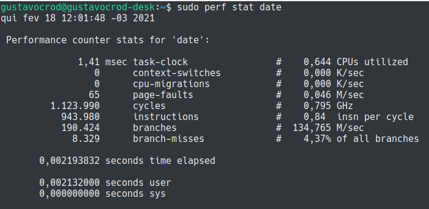
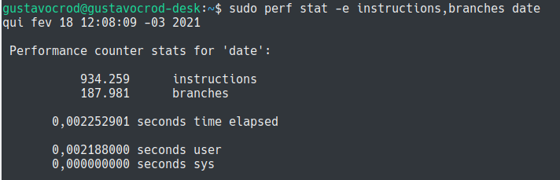
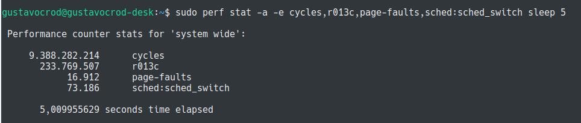

# Uso da ferramenta perf, no sistema operacional Linux.

____
### 1. Bancada de testes

##### 1.1 Hardware

    - Placa-mãe Gigabyte H110M-H
    - 2x8 8192 MB RAM DDR4 2133 MHz
    - Intel Core i5 6400:
        * Núcleos: 4 Cores e 4 Threads
        * Clock: Frequência base 2.70 GHz e Frequência turbo max 3.30 GHz 
        * Cache: L1 Cache 256kB; L2 Cache 1024 kB; L3 Cache 6144 kB

##### 1.2 Sistema Operacional

    - Ubuntu 18.04.1
    - Kernel 5.4.0-65-generic
____

____
### 2. A Ferramenta Perf

Perf pode ser definido como um conjunto de ferramentas baseados na interface `perf_events` do kernel. 
Há um comando que também é perf, que realiza a interface entre o usuário e o subsistema (interface) `perf_events`.
O perf é uma ferramenta de análise, monitoramento e depuração baseada em eventos, ou seja, os eventos devem ser
predefinidos para que seja possível coletá-los e processá-los durante o processo de análise.

Esses eventos mensuráveis podem ser vistos na figura abaixo e compreendem: Eventos de *hardware*, eventos de *software*, *tracepoints* dinâmicos e estáticos.


##### 2.1 Eventos
A ferramenta suporta vários eventos como visto na figura, sendo esses advindos de diferentes fontes. Alguns eventos são *kernel counters* puramente, nesse caso são chamados de **eventos de software**. Por exemplo as trocas de contexto.

Outros eventos podem ser provenientes do próprio processador e de sua Unidade de Monitoramento de Desempenho (PMU - *Performance Monitoring Unit). ELa provê uma lista de eventos para avaliar eventos micro-arquiteturiais como o número de ciclos, instruções retiradas, cache-miss da L1... Esses eventos são chamados de **eventos de hardware**.

A *perf_events* também prove um pequeno grupo de eventos monitores de hardware. Em cada processador, esses eventos são mapeados em eventos reais fornecidos pela CPU, se eles existem, senão aquele evento não pode ser usado. Esses também são chamados **eventos de hardware**.

Existem também os **eventos de tracepoints** (eventos de pontos de rastreamento) que são implementados pela infraestrutura `ftrace` do kernel. 

### 3. Uso do *perf stat*

A forma de uso mais simples do perf é através do *perf stat*. Esse subcomando realiza a contagem de eventos.

```$ sudo perf stat date ```



Nesse comando, o perf stat é invocado com o date, e tendo em vista que nenhum evento foi especificado, o perf realizou alguns contadores genéricos de **hardware** e **software** que ocorreram durante a execução do comando.
____

A utilização da *flag -e* permite selecionar um ou mais eventos.

```$ sudo perf stat -e instructions,branches date ```



Nesse exemplo, os eventos *instructions* e *branches* foram selecionados simultaneamente.

____

Também é possível mesclar diferentes fontes de eventos em uma única análise, permitindo a integração de vários tipos de eventos.

``` sudo perf stat -a -e cycles,r013c,page-faults,sched:sched_switch sleep 5 ```



A adição da opção *-a* permite instrumentar os eventos de todos os processos de todas CPUs durante a execução do comando.
Os comandos executados são:
    - *cycles*: **evento de hardware** que conta o número de ciclos;
    - *r013c*: **evento de hardware** acessado através do identificador 0x013C que representa o evento *bus-cycles*;
    - *page-fault*: **evento de software** que conta o número de violações *page faults*;
    - *sched:sched_switch*: **evento tracepoint** estático relacionado às trocas de contexto do escalonador.
    - *sleep 5*: programa de execução usado como teste

 
Estudo baseado em: 
Linux kernel profiling with perf: https://perf.wiki.kernel.org/index.php/Tutorial
EMPREGO DO PERF NA MEDIÇÃO E ANÁLISE DO TEMPO DE RESPOSTA DE TAREFAS NO LINUX: https://repositorio.ufsc.br/bitstream/handle/123456789/211642/PEAS0312-D.pdf?sequence=-1&isAllowed=y
