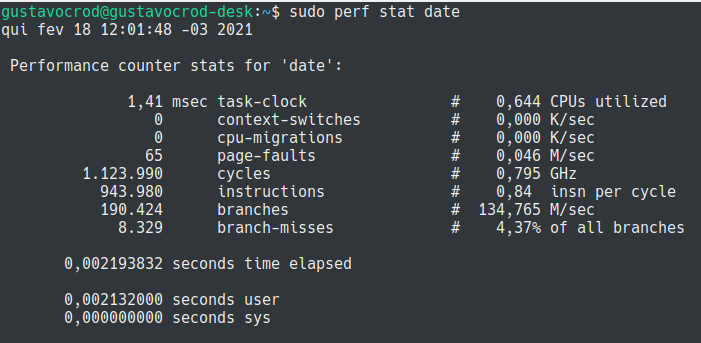
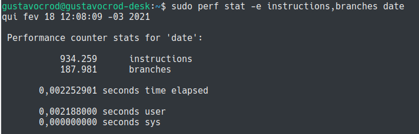
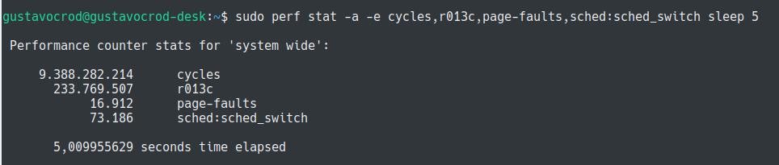
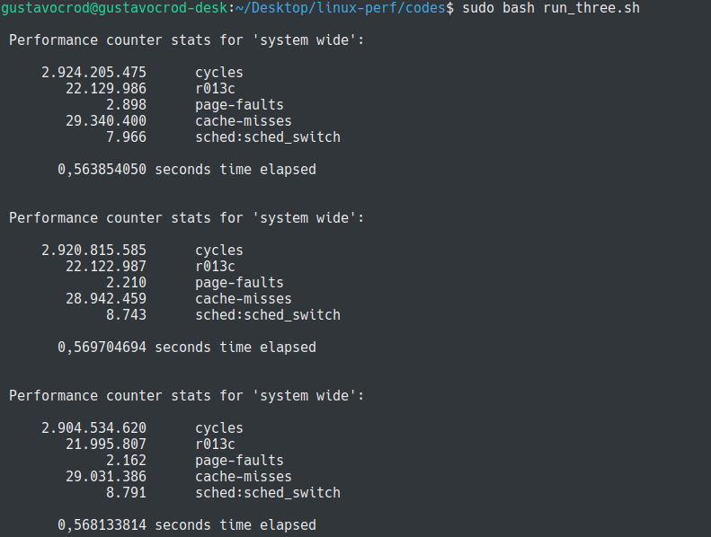
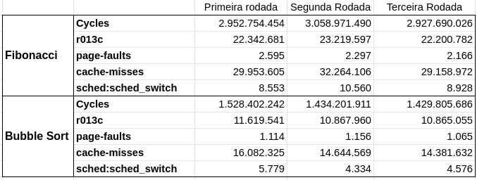
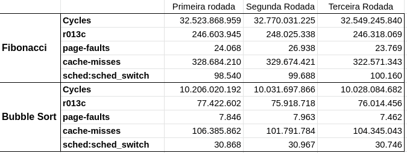
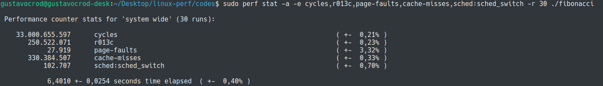

# Uso da ferramenta perf, no sistema operacional Linux.

____
### 1. Bancada de testes

##### 1.1 Hardware

    - Placa-mãe Gigabyte H110M-H
    - 2x8 8192 MB RAM DDR4 2133 MHz
    - Intel Core i5 6400:
        * Núcleos: 4 Cores e 4 Threads
        * Clock: Frequência base 2.70 GHz e Frequência turbo max 3.30 GHz 
        * Cache: L1 Cache 256kB; L2 Cache 1024 kB; L3 Cache 6144 kB

##### 1.2 Sistema Operacional

    - Ubuntu 18.04.1
    - Kernel 5.4.0-65-generic
____

***Prólogo***

Como o Linux é *opensource*, ferramentas pensadas para o auxílio em processos como análise de desempenho (*profiling*) e uso do sistema foram desenvolvidas. Dentre elas, existem a **KProbes** (mecanismo de depuração para kernel LInux que pode ser usado para monitorar eventos dentro de um sistema, como registrar eventos específicos, rastrear problemas e etc), a **Geekbench** (ferramenta para *benchmark* da CPU com interface gráfica - que facilita o uso quando comparado com apenas terminal - que fornece também métricas para *benchmark* em GPU) e a Perf (que será estudada nesse artigo).

____
### 2. A Ferramenta Perf

Perf pode ser definido como um conjunto de ferramentas baseados na interface `perf_events` do kernel. 
Há um comando que também é perf, que realiza a interface entre o usuário e o subsistema (interface) `perf_events`.
O perf é uma ferramenta de análise, monitoramento e depuração baseada em eventos, ou seja, os eventos devem ser
predefinidos para que seja possível coletá-los e processá-los durante o processo de análise.

Esses eventos mensuráveis podem ser vistos na figura abaixo e compreendem: Eventos de *hardware*, eventos de *software*, *tracepoints* dinâmicos e estáticos.


##### 2.1 Eventos
A ferramenta suporta vários eventos como visto na figura, sendo esses advindos de diferentes fontes. Alguns eventos são *kernel counters* puramente, nesse caso são chamados de **eventos de software**. Por exemplo as trocas de contexto.

Outros eventos podem ser provenientes do próprio processador e de sua Unidade de Monitoramento de Desempenho (PMU - *Performance Monitoring Unit). ELa provê uma lista de eventos para avaliar eventos micro-arquiteturiais como o número de ciclos, instruções retiradas, cache-miss da L1... Esses eventos são chamados de **eventos de hardware**.

A *perf_events* também prove um pequeno grupo de eventos monitores de hardware. Em cada processador, esses eventos são mapeados em eventos reais fornecidos pela CPU, se eles existem, senão aquele evento não pode ser usado. Esses também são chamados **eventos de hardware**.

Existem também os **eventos de tracepoints** (eventos de pontos de rastreamento) que são implementados pela infraestrutura `ftrace` do kernel. 

### 3. Uso do *perf stat*

A forma de uso mais simples do perf é através do *perf stat*. Esse subcomando realiza a contagem de eventos.

```$ sudo perf stat date ```



Nesse comando, o perf stat é invocado com o date, e tendo em vista que nenhum evento foi especificado, o perf realizou alguns contadores genéricos de **hardware** e **software** que ocorreram durante a execução do comando.
____

A utilização da *flag -e* permite selecionar um ou mais eventos.

```$ sudo perf stat -e instructions,branches date ```



Nesse exemplo, os eventos *instructions* e *branches* foram selecionados simultaneamente.

____

Também é possível mesclar diferentes fontes de eventos em uma única análise, permitindo a integração de vários tipos de eventos.

(-a monitora todos os cores)

``` sudo perf stat -a -e cycles,r013c,page-faults,sched:sched_switch sleep 5 ```



A adição da opção *-a* permite instrumentar os eventos de todos os processos de todas CPUs durante a execução do comando.
Os comandos executados são:

    - *cycles*: **evento de hardware** que conta o número de ciclos;
    - *r013c*: **evento de hardware** acessado através do identificador 0x013C que representa o evento *bus-cycles*;
    - *page-fault*: **evento de software** que conta o número de violações *page faults*;
    - *sched:sched_switch*: **evento tracepoint** estático relacionado às trocas de contexto do escalonador.
    - *sleep 5*: programa de execução usado como teste

____
### 4. Estudo de caso

Para os devidos testes, utilizaremos de dois algoritmos desenvolvidos na linguagem Python 3. A primeira delas é a sequência de fibonacci, 
onde objetivamos calcular o 45-ésimo número de forma recursiva. E o segundo é o algoritmo de ordenação Bubble sort, aplicado em um vetor de tamanho 10000 pseudo-aleatóriamente inicializado.


```C

#include <stdio.h>

int fibonacci(int n) {
  int x;
  
  if (n == 1) {
    return(1);
  }
  
  if (n == 2) {
    return(1);
  }
  
  x = fibonacci(n-1) + fibonacci(n-2);
  return(x);
}

int main() {
  int n = 45;
  fibonacci(n);
  return(0);
} 

```
----
```C

#include <stdio.h>
#include <stdlib.h>
#include <time.h>

void bubble_sort(int vetor[], int n) {
    int k, j, aux;

    for (k = 0; k < n - 1; k++) {
        for (j = 0; j < n - k - 1; j++) {
            if (vetor[j] > vetor[j + 1]) {
                aux = vetor[j];
                vetor[j] = vetor[j + 1];
                vetor[j + 1] = aux;
            }
        }
    }
    
}

int main() {
    int i, array[10000];
    srand(time(0));
    for(i=0; i < 10000; i++){
        array[i]=rand()%1000;
    }
    bubble_sort(array, 10000);

    return 0;
}

```

##### 4.1 Execução Fibonacci

Para a **primeira atividade**, vamos verificar se há diferença entre a primeira execução do código, com a segunda e terceira.

``` sudo perf stat -a -e cycles,r013c,page-faults,sched:sched_switch ./fibonacci ``` será executado, através de um shell script

```bash
#!/bin/bash

for counter in $(seq 1 3); 
    do sudo perf stat -a -e cycles,r013c,page-faults,cache-misses,sched:sched_switch ./fibonacci.x; 
done
```

Sendo:

    - *cycles*: Contagem de ciclos;
    - *r013c*: Contagem de *bus-cycles*;
    - *page-fault*: Contagem do número de violações *page faults*;
    - *sched:sched_switch*: Contagem de trocas de contexto do escalonador.
    - *cache-misses*: Contagem de erros de *cache-miss*
    - *fibonacci.x*: programa de execução usado como teste



Com três execuções sequenciais do programa, podemos vislumbrar um decréscimo dos page-faults em cada execução. Isso faz sentido com a relação de que a cada execução subsequente, alguns dados ainda estavam nas páginas. Os cache-misses oscilaram, mas creio que devido a redução dos erros de paginação, os ciclos totais diminuiram.

Em um **segundo caso**, vamos executar três vezes esse código, porém intercalando com a ordenação do vetor.

```bash
#!/bin/bash

for counter in $(seq 1 3); 
    do sudo perf stat -a -e cycles,r013c,page-faults,cache-misses,sched:sched_switch ./fibonacci; 
    do sudo perf stat -a -e cycles,r013c,page-faults,cache-misses,sched:sched_switch ./bubble_sort;
done
```



Ainda com a execução intercalada, o número de page faults continuou decrescendo. E os demais dados são semelhantes às execuções sequenciais.
Isso pode ocorrer devido ao acaso, por conta da amostragem ser pequena (três execuções).


Como **Terceiro teste** vamos aumentar o número da sequencia de fibonacci pesquisado, e o tamanho do vetor para ordenação pelo bubble sort.

Vamos com 45-ésimo termo da sequencia e o array de 10000 para 25000.



Agora é possível visualizar que a intercalação dos código impactou nas page-miss e cache-miss. O número de page-fault oscilou e não apenas decresceu como havia ocorrido antes. O número de execuções ainda é baixo para realizar inferências estatísticas, porém já se percebe o impacto.

*desafio: execute o mesmo código para mais de 20 rodadas*;

Para o **quarto** e último caso, vamos executar o algoritmo de fibonacci para o 45-ésimo número, utilizando a *flag -r*, que permite executar uma análise n vezes.

Para isso, executamos o seguinte código:

```
$ sudo perf stat -a -e cycles,r013c,page-faults,cache-misses,sched:sched_switch -r 30 ./fibonacci
```



Com 30 execuções, podemos ver que o número de páginas foi o que mais oscilou (desvio de +- 3,32%).

____

### 5. Conclusão

Com esse breve estudo sobre a ferramenta de perfilamento de código e execução Perf, foi possível constatar que o seu uso é de grande valia quando objetiva-se entender e otimizar a execução de um programa ou sistema. Com sua vasta gama de parametros e comandos relacionados a vários tipos de monitoramentos, ela permite traçar o perfil de um código, bem como avaliar o seu desempenho em execução. Contudo, destaco a baixa eficiência da mesma quanto a riqueza de material na web e da "dificuldade" que a mesma insere ao usuário comum, ao utilizar-se apenas de terminal nos dias atuais (2021).


___
Estudo baseado em: 
Linux kernel profiling with perf: https://perf.wiki.kernel.org/index.php/Tutorial
EMPREGO DO PERF NA MEDIÇÃO E ANÁLISE DO TEMPO DE RESPOSTA DE TAREFAS NO LINUX: https://repositorio.ufsc.br/bitstream/handle/123456789/211642/PEAS0312-D.pdf?sequence=-1&isAllowed=y
https://perf.wiki.kernel.org/index.php/Tutorial#Commands
